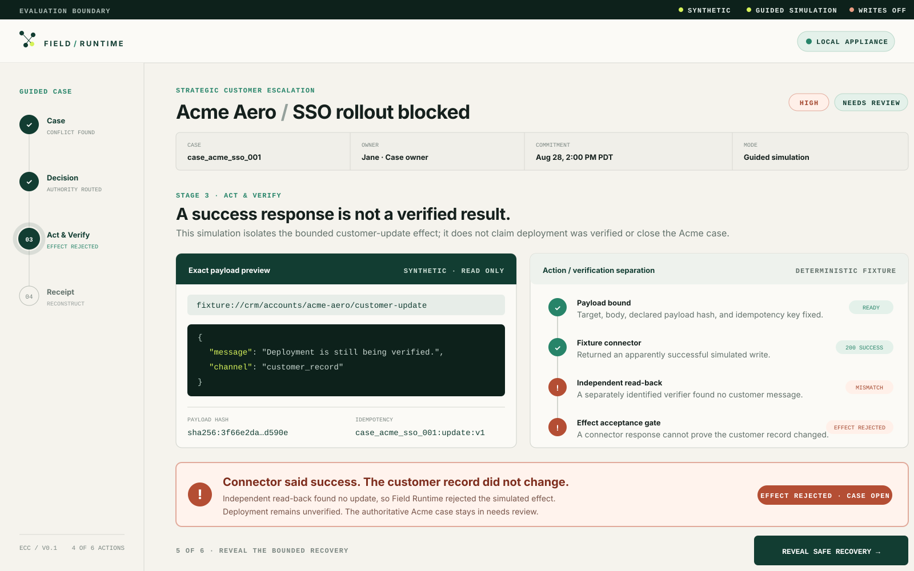

# Field Runtime Core

Field Runtime Core is the open, inspectable **Case + Authority + Outcome runtime**
for consequential operational work. This Apache-2.0-licensed repository is a
self-hosted evaluation preview of that **Enterprise Case Runtime**.

Most AI systems stop at an answer or a completed task. Consequential work does not.
It crosses systems and people, accumulates contradictory evidence and commitments,
and requires authority that changes with the consequence. Field Runtime keeps that
work together as one complete case: evidence, conflicts, participants, commitments,
decision options, authority, approvals, exact actions, independent verification,
outcomes, corrections, receipts, and replay lineage.

The Case is the canonical unit of work. Evidence, identity, authority, action,
verification, outcome, receipts, and correction bind to that Case rather than to a
worker session. In messy environments, Field Runtime may form a Case candidate from
fragmented signals while preserving provenance, conflicts, unknowns, and
uncertainty. If a customer already has a mature case-management, ticket, claims, or
work system, that system remains the system of record: Field Runtime maps or
imports its Case contract and enters at the governed execution layer. It does not
require replatforming or forced rediscovery of already-coherent Case state.

The differentiated kernel is
`CASE + EVIDENCE + AUTHORITY + ACTION + VERIFICATION + OUTCOME + RECEIPT + CORRECTION`.

The goal is to increase an experienced operator's power without transferring
control to a model or provider. Models and agents may propose; named people retain
authority. Business authority is not equivalent to tool permission. Canonical Case
state and deterministic controls stay in the runtime, while models, agents, memory
systems, work surfaces, and connectors remain replaceable workers and adapters.
Organizations can change providers without surrendering the Case history,
operating rules, or learning they created.

> **Evaluation Preview** — Synthetic cases. Simulated authority. No external
> writes. Not production software. Production authority must be earned.



The current source Workbench opens the [persistent synthetic credit review](apps/admin/README.md):
explicit initialization, Finance approval, refresh, Executive approval and reload.
Approvals remain separate from execution, which is unavailable.

The pictured legacy story is available at `/?view=legacy`: four synthetic sources disagree, the model
proposes, named people retain authority, a fixture connector reports success, and
a simulated independent read-back finds no matching update. The walkthrough shows
why the effect must be rejected and the case kept open.

[Run the five-minute evaluation](docs/guides/5-minute-evaluation.md) ·
[Read the security boundary](SECURITY.md) · [See the open-core boundary](OPEN_CORE.md)

## Evaluation preview boundary

This repository is an **evaluation foundation**, not a production release. It is
local-first, synthetic, deterministic in its implemented runtime slice, and makes
no external writes. It needs no model API key or enterprise credentials.

Implemented in the current evaluation foundation:

- A TypeScript and pnpm monorepo foundation.
- The canonical Field Runtime Case and CaseJournalEntry JSON Schemas.
- The Escalation and Commitment Control (ECC) workflow contract and decision graph.
- Thirty synthetic evaluation cases and one schema-valid canonical case fixture.
- A scored ECC Production Test with a gold-isolated adapter boundary,
  machine-readable hash-addressed receipts, hard safety gates, and a failing
  answer-only negative control.
- Deterministic case-state transition helpers.
- A pure case engine with idempotent creation, explicitly targeted event attachment,
  optimistic version checks, and fail-closed transitions.
- A schema-validated, hash-chained case journal with deterministic replay, audit
  projection, and projection-drift detection.
- Durable PostgreSQL projection, journal, idempotency, source-identity, and emitted-ID
  persistence with atomic commands, compare-and-swap projection updates, and
  append-only controls.
- A loopback-only HTTP API, in-process transactional worker, checksum-bound
  migrations, and immutable evaluation-fixture catalog.
- A fail-closed `fr` CLI plus Docker Compose appliance for the ECC demo.
- A direct-to-case guided workbench that makes the complete ECC story visible as
  an explicitly synthetic, non-authoritative simulation.
- Contract, fixture, transition, idempotency, journal, persistence, API, CLI, and
  adversarial tests.

Planned, not implemented yet:

- automatic Case candidate formation and matching;
- existing external Case import and mapping;
- Operational Legibility;
- an authoritative approval engine;
- a deny-by-default action gateway;
- an independent verifier;
- a general worker runtime and provider adapters;
- live connectors; and
- production identity, control, high availability, and operations.

## Target product boundary

| Layer              | What it does                                                     | Typical authority                                     |
| ------------------ | ---------------------------------------------------------------- | ----------------------------------------------------- |
| Copilot            | Produces an answer or insight                                    | Advisory, with optional tool grants                   |
| Automation         | Runs an expected procedure                                       | Predefined path only                                  |
| Standalone agent   | Completes a bounded task                                         | Bounded task grant                                    |
| Field Runtime Core | Retains the complete case through an authorized, verified result | Deterministic policy plus attributable human approval |

Field Runtime is not another agent. Its product contract is the governed runtime
around agents and systems of record that retains the case through uncertainty,
handoffs, approval, action, independent verification, and correction.

There are two valid entry modes: form a Case candidate when operational work
arrives as fragmented signals, or preserve and map a coherent Case from a trusted
upstream system. In both modes, the Case remains canonical outside any worker
session and the upstream system remains the system of record for the data it owns.

Models and agents may extract, synthesize, and recommend. They cannot authorize,
execute, verify their own work, or promote learning inside the trusted core.

The current preview makes that contract inspectable with synthetic fixtures and a
guided simulation. The deterministic authority, action, and verification controls
needed to enforce the complete contract at runtime are planned for D6–D7; they are
not implemented in this release candidate.

## Quick start

Repository validation requires Node.js 24 and pnpm 11.

```bash
corepack enable
pnpm install --frozen-lockfile
pnpm validate

# Run the 30-case Field Runtime Production Test
pnpm eval:ecc -- --subject-version=<commit-sha>
```

The local appliance additionally requires Docker with Compose. From the cloned
repository root:

```bash
pnpm fr init ecc --demo
pnpm fr up

# Open http://127.0.0.1:3210/ in a browser
curl http://127.0.0.1:3210/readyz
curl http://127.0.0.1:3210/v0/evaluation-fixtures/ecc/case_acme_sso_001
```

`fr up` refuses contradictory configuration and directories that are not the
Field Runtime Core repository root. The API and PostgreSQL ports are bound to
loopback, the runtime is fixed to simulation mode, and external writes are
disabled. The bundled credentials are local-evaluation credentials only.

See [local evaluation operations](docs/operations/local-evaluation.md) for API
routes, shutdown, data retention, and troubleshooting.

For the complete six-action product story, use the
[five-minute evaluation](docs/guides/5-minute-evaluation.md).

## Repository map

```text
apps/api/                Loopback-only local evaluation API
apps/admin/              Guided Case → Decision → Act & Verify → Receipt workbench
apps/worker/             In-process transactional command and bootstrap services
packages/domain/         Deterministic domain vocabulary and state rules
packages/contracts/      Canonical boundary schemas
packages/runtime/        Pure engine plus PostgreSQL persistence boundary
packages/cli/            Fail-closed local appliance CLI
packages/ecc-pack/       ECC workflow, decision graph, fixtures, and evals
docs/benchmarks/         Published evaluation methodology and honest limitations
docs/                    Architecture, security, and operations
tests/                   Cross-package contract tests
```

Read `PRODUCT_SPEC.md`, `AGENTS.md`, and `STATUS.md` before changing product
behavior. Architecture decisions live in `DECISIONS.md`.

## Public roadmap

GitHub PRs #6, #12, and #14 delivered release readiness, public launch
finalization, and prerelease automation. The future capability sequence uses
stable **Delivery labels D6–D20**. Delivery labels are not GitHub pull request
numbers; the actual GitHub number may differ and will be linked when work begins.

| Delivery item                                        | Status  | Scope                                                                                                                                                                                                                                                 |
| ---------------------------------------------------- | ------- | ----------------------------------------------------------------------------------------------------------------------------------------------------------------------------------------------------------------------------------------------------- |
| D6 — Governed Case Session                           | Planned | Authoritative identity, delegation, business authority, exact Case roles, payload-bound approvals, deterministic authority resolution, and a runtime-backed Decision Packet                                                                           |
| D7 — Controlled Action + Independent Verification    | Planned | Staged, deny-by-default action with idempotency and preconditions; a separate verifier identity/read path; no self-verification; simulated effects only                                                                                               |
| D8 — Receipts + Economics + Failure Theater          | Planned | Reconstructable authority/action/verifier/outcome lineage, interventions, wait/handoff time, cost per accepted outcome, and visible failure of unsafe paths                                                                                           |
| D9 — Intake + Case Formation                         | Planned | Provenance-preserving intake, related-signal linking, uncertainty-preserving Case candidates, and safe mapping/import of Cases from existing customer systems                                                                                         |
| D10 — Case Discovery + Operational Legibility        | Planned | Reconstruct representative work, separate authoritative fact/policy/memory/extraction/inference, expose gaps/conflicts, and classify operational work without inventing authority                                                                     |
| D11 — Runtime Builder                                | Planned | Human confirmation of discovered or imported operating structure and compilation of a reviewed, versioned Organization Runtime Pack                                                                                                                   |
| D12 — Work Agent Runtime                             | Planned | Bounded Worker Adapter Contract and Broker, one reference worker, BYO-agent/harness compatibility, Worker Packs, optional adapters, and no worker-owned canonical Case state                                                                          |
| D13 — 25-Case Challenge                              | Planned | A 3–5 day entry product measuring Case reconstructability, agent-workable and judgment-required work, authority/evidence gaps, human effort, cycle-time opportunity, and economics, with commercial credit toward a Production Test where appropriate |
| D14 — One-Command / Self-Serve Distribution          | Planned | Zero-install or one-command try path and a polished `/try` experience for Case Formation and the Challenge                                                                                                                                            |
| D15 — Worker / Model Routing + Intelligence Receipts | Planned | Replaceable provider/model routing by task, risk, authority, cost, capability, warm state, and verified outcomes                                                                                                                                      |
| D16 — Correction + Branch + Replay / Operational CI  | Planned | Correction lineage, changed-fact replay, evaluated learning candidates, approval before promotion, and rollback                                                                                                                                       |
| D17 — Read-Only Real-World Connectors                | Planned | Read-only email, CRM, and ERP/accounting or equivalent connectors with preserved provenance and no unrestricted worker credentials                                                                                                                    |
| D18 — Shadow-Mode Production Test                    | Planned | One real recurring workflow without production writes, compared with the human process across accepted completion, interventions, authority gaps, cycle time, and economics                                                                           |
| D19 — Multiplayer Enterprise Coordination + Control  | Planned | Human/agent/service identities, delegation, team coordination, policy/control views, cost, audit, and fleet health after trusted runtime and shadow evidence                                                                                          |
| D20 — Progressive Governed Action                    | Planned | Narrow production writes, explicit authority, reversible or preconditioned actions where possible, kill switch, independent verification, and evidence-based authority expansion                                                                      |

Operational Legibility is an explicit gate: D12 is not product-ready until D9–D10
demonstrate trustworthy Case formation or import, provenance, conflict and
uncertainty handling, no invented authority, and a human-review path for ambiguity.

Planned means planned, not present in this evaluation preview. See [`PLAN.md`](PLAN.md)
for exit criteria and [`STATUS.md`](STATUS.md) for the implemented boundary.

## Distribution

Field Runtime Core source is publicly distributed under the
[Apache License 2.0](LICENSE). The first workflow pack is ECC. The
`v0.1.0-evaluation-preview.0` source release is published as a GitHub prerelease
after completing the [repository checklist](docs/releases/public-repository-checklist.md)
and hosted CI.

This source release is clone-based. Signed artifacts, a standalone installer,
SBOM, provenance, upgrades, and uninstall flows remain a later milestone. See
[`OPEN_CORE.md`](OPEN_CORE.md), [`TRADEMARKS.md`](TRADEMARKS.md), and the
[`v0.1.0 evaluation preview`](docs/releases/v0.1.0-evaluation-preview.md) notes.

## About Field Runtime

Field Runtime is the company behind this project. Its broader product vision is:
**run your company on intelligence you own.** Start with one decision-heavy
workflow, assemble the evidence, keep the decision with the right person,
coordinate action to a verified outcome, and carry reviewed learning into the next
case—without replatforming or model lock-in. Your data and learning remain yours.

Field Runtime Core is the inspectable, evaluation-only foundation for that vision;
it is not the production platform or a hosted Field Runtime service. Learn more at
[fieldruntime.ai](https://fieldruntime.ai).
