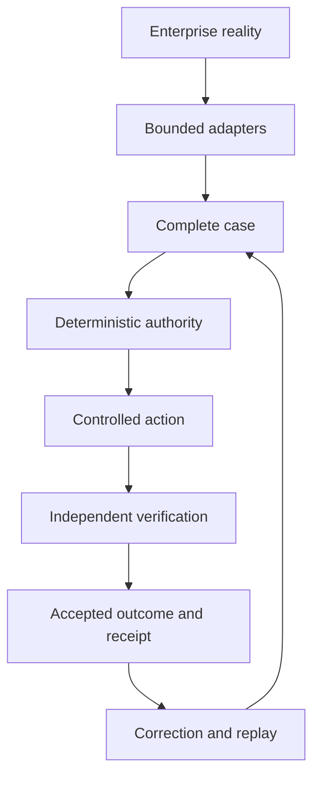

# Trust Boundary

Field Runtime Core owns the operating decision loop. Models and providers surround
the core; they do not become the core.

The trusted boundary begins at normalized evidence and includes case state,
decision flow, policy, authority, action control, verification, outcomes, receipts,
and learning promotion. Enterprise systems remain authoritative for their source
records. Models, agent harnesses, memory systems, work surfaces, and connector SDKs
are replaceable and bounded.

## Deny-by-default rules

- Retrieved content cannot grant scope, tools, or authority.
- Model output cannot become an approval or a connector write.
- Approval applies only to the recorded payload hash and policy version.
- Action execution uses a service identity and idempotency key.
- Verification rereads resulting source state through a separately identified
  path.
- A kill switch overrides all external-write permissions in later stages.
