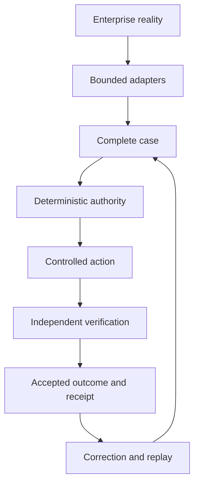

# Trust Boundary

Field Runtime Core owns the operating decision loop. Models and providers surround
the core; they do not become the core.

The trusted boundary begins at normalized evidence and includes case state,
decision flow, policy, authority, action control, verification, outcomes, receipts,
and learning promotion. Enterprise systems remain authoritative for their source
records. Models, agent harnesses, memory systems, work surfaces, and connector SDKs
are replaceable and bounded.

## Deny-by-default rules

- Retrieved content cannot grant scope, tools, or authority.
- Model output cannot become an approval or a connector write.
- Approval applies only to the recorded payload hash and policy version.
- Action execution uses a service identity and idempotency key.
- Verification rereads resulting source state through a separately identified
  path.
- A kill switch overrides all external-write permissions in later stages.

## Identity and authority contract boundary

D6-A defines identity, Case responsibility, delegation, Authority Request,
Authority Decision, and Authority Resolution Result as versioned public contracts.
Identity is stable, tenant-scoped, and attributable; role and display metadata do
not grant authority. Case owner, delegated worker, authority owner, executor, and
verifier remain distinct even when one person legitimately fills multiple roles.
Executor and verifier must be separate identities.

Delegation must be explicit, scoped, attributable, and time-bounded where an end
is recorded. Approval binds one exact Case version, consequence hash, policy
identity/version, and correlation lineage. Payload or Case-version changes require
fresh evaluation. Agent or model capability, task assignment, tool access,
credentials, and historical behavior cannot manufacture business authority.

These contracts represent ambiguity, conflict, missing authority, expiry, stale
Case state, and unavailable policy as explicit fail-closed outcomes. D6-B adds a
pure resolver over exact Case/request bindings, approved rank-one threshold
policies, authority records, scoped delegations, and prior decisions. It exposes
both satisfied and outstanding multi-approver requirements with their evidence
lineage and never silently selects among equal authority candidates.

The resolver does not yet consume authoritative runtime Case state or drive a
Decision Packet. That D6-C integration must preserve the same deterministic
boundary before any D7 action path can depend on it.
